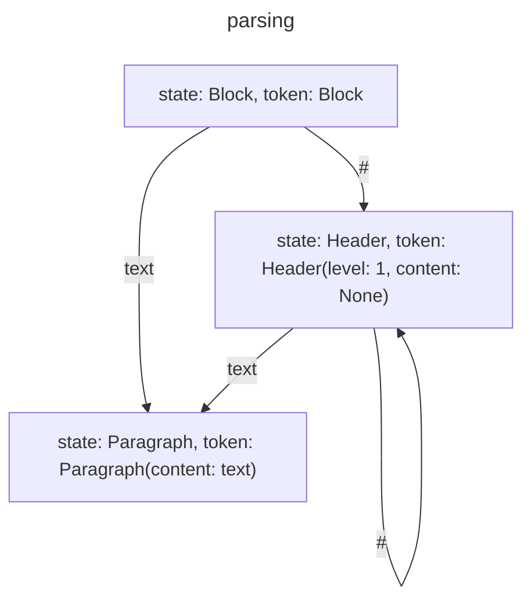

# mdparser
A markdown parser written in rust.

## parse strategy

```mermaid
---
title: parsing 
---
flowchart TD
  A["state: Block, token: Block"] -->|#| B["state: Header, token: Header(level: 1, content: None)"]
  A["state: Block, token: Block"] -->|text| C["state: Paragraph, token: Paragraph(content: text)"]
  B -->|#| B
  B -->|text| C
```
